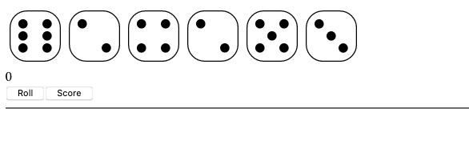

### Dice King

Massively Multiplayer Online Farkle

Dice game like Farkle, but instead of the results of each roll becoming part of your score, it instead adds to resource pools for offense or defense. The idea being to build a "kingdom" by spending these points on defenses, while also allocating resources to fight opponents, degrading their kingdoms.

# Goals
- Dice roll generator
	- ~Initial roll~
	- ~Dice saver~
	- ~Toss entire roll if no scoring dice rolled~
	- ~Continue rolling if all dice score~
- Server
	- ~Serve game resources from server~
	- ~Port scoring algorithm from JS to Go~
	- ~Add tests for scoring algorithm~
	- Serve rolls from server
	- User session handling
	- Lobby for matchmaking
	- In-game chat
	- Twitch integration for spectator interaction and influence
- Resource spending
	- Castle
	- Army
- Attack sequence
- Defense sequence
- Win conditions
	- Score
	- Time
	- Long-running games?
- Visuals
	- Castle
	- Attack
- Multiple players